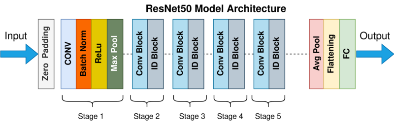

# Dogs Identifier

### Streamlit Content
1. [Introduction](#introduction)
2. [Technologies](#technologies)
3. [Setup Guide](#setup-guide)
4. [Visual Presentation](#visual-presentation)

### ML Content
5. [Introduction to Machine Learning Content](#introduction-to-machine-learning-content)
6. [Machine Learning Technologies](#machine-learning-technologies)
7. [Machine Learning Setup Guide](#machine-learning-setup-guide)
8. [ResNet50 and Adam optimizer](#resnet50-and-adam-optimizer)
    - [ResNet50](#resnet50)
    - [Adam optimizer](#adam-optimizer)
9. [Dataset Description](#dataset-description)
10. [Machine Learning Metrics](#machine-learning-metrics) 
    - [Training History](#training-history)
11. [Machine Learning Examples](#machine-learning-examples)
12. [Future Development Plan](#future-development-plans)
13. [Machine Learning Description](#machine-learning-description)

## Introduction
This project is designed for learning ML and streamlit.

The result of this project is a web app consisting of a machine learning module, database, and a visual interface.

Project features include:
- Detecting dog breeds using photos.
- Adding dogs with their picture, breed, and curiosity to the database.
- Learning about dogs with a list of their breeds, curiosities, and photos.

## Technologies

This project was made with:
- &nbsp;**MySQL**: 8.3.0
- &nbsp;**Python**: 3.9
- &nbsp;**Streamlit**: 1.33.0


## Setup guide

### Prerequisites

To install this software and be able to run it, you need to install packages from requirements.txt and run mysql server

### Installing the Application 

After you clone the repository, you need to run the terminal and go to the directory `\Dockerized\app`, which contains all the files and run this command:

```bash
streamlit run app.py
```


## Visual Presentation

<div align="center">
  <br />
  <strong>Main Page</strong>
</div>

<br />

<div align="center">
  <br />
  <strong>Detection dogs breed</strong>
</div>

<br />

<div align="center">
  <br />
  <strong>Discover dog</strong>
</div>

<br />

<div align="center">
  <br />
  <strong>Edit dog info</strong>
</div>

## Introduction to Machine Learning Content
This section of the documentation explains how Machine Learning (ML) system works. The primary purpose of this ML model is to detect dog breeds from photos uploaded by users through a Streamlit app.

## Machine Learning Technologies 
Model was created using:
- &nbsp;**PyTorch**: 2.3.1

For visual detection, project uses the ResNet50 architecture with the Adam optimizer.
## ResNet50 and Adam optimizer

### ResNet50
ResNet50, or Residual Network with 50 layers, is a popular deep neural network architecture designed for image recognition. It was introduced by Kaiming He and his colleagues in 2015. The primary innovation in ResNet is the use of "residual blocks," which allow for the construction of very deep networks without the problem of vanishing gradients, a major challenge in traditional deep neural networks.

### Key Features of ResNet50:
1. **Residual Blocks**: These blocks consist of several layers, with an additional "shortcut" connection that bypasses one or more layers, allowing for more effective training of very deep networks.
2. **Depth**: ResNet50 has 50 layers, making it a deep network capable of learning complex features from input data.
3. **Performance**: It has been shown to achieve state-of-the-art results in various image recognition tasks, including winning the ImageNet Large Scale Visual Recognition Challenge (ILSVRC) in 2015.
4. **Applications**: ResNet50 is widely used in computer vision tasks such as image classification, object detection, and image segmentation.

ResNet50's architecture can be visualized as a series of residual blocks, each containing convolutional layers, batch normalization, and ReLU activation functions, interspersed with shortcut connections.


<div align="center">
  <br />
  <strong>Resnet50 architecture</strong>
</div>

### Adam optimizer

The Adam optimizer, which stands for Adaptive Moment Estimation, is an algorithm for gradient-based optimization of stochastic objective functions. It was introduced by Diederik P. Kingma and Jimmy Ba in 2014. Adam combines the advantages of two other popular optimization methods: Adaptive Gradient Algorithm (AdaGrad) and Root Mean Square Propagation (RMSProp).

### Key Features of Adam Optimizer:
1. **Adaptive Learning Rates**: Adam computes individual adaptive learning rates for different parameters from estimates of first and second moments of the gradients.
2. **Efficient Computation**: It requires relatively low memory and is computationally efficient, making it well-suited for large datasets and high-dimensional parameter spaces.
3. **Bias Correction**: The algorithm includes bias-correction mechanisms to account for the initialization of moment estimates, which can improve performance in the early stages of training.
4. **Parameters**:
    - **Learning Rate (\(\alpha\))**: Typically set to 0.001 by default.
    - **Beta1 (\(\beta_1\))**: The exponential decay rate for the first moment estimates, usually set to 0.9.
    - **Beta2 (\(\beta_2\))**: The exponential decay rate for the second moment estimates, usually set to 0.999.
    - **Epsilon (\(\epsilon\))**: A small constant to prevent division by zero, typically set to \(10^{-8}\).

Adam is widely used in training deep learning models due to its efficiency and effectiveness.
## Machine Learning Setup Guide
To run the ML model, follow these steps:
1. **Download and Install CUDA Drivers and NVIDIA Toolkit** First, download and install the CUDA drivers version 12.1 and the NVIDIA Toolkit. You can download them from the following link: [CUDA 12.1.0 Download Archive](https://developer.nvidia.com/cuda-12-1-0-download-archive)
2. **Install PyTorch** 
After installing the necessary drivers and toolkit, you need to install PyTorch. You can follow the instructions on the [PyTorch Get Started page](https://pytorch.org/get-started/locally/), or use one of the following commands:
For pip users:
``pip3 install torch torchvision torchaudio --index-url https://download.pytorch.org/whl/cu121``
For anaconda users:
``conda install pytorch torchvision torchaudio pytorch-cuda=12.1 -c pytorch -c nvidia``

3. **Install packages** Later on it is required to download packages from requirement.txt from the section "#ML"
4. **Running Python file**
In the terminal move to the "model" folder and run:
``
python ml.py
``
## Dataset Description
The dataset used to create this project was "Stanford Dogs Dataset" it can be found here: [Stanford Dogs Dataset](http://vision.stanford.edu/aditya86/ImageNetDogs/).
The Stanford Dogs dataset contains images of 120 breeds of dogs from around the world. This dataset has been built using images and annotation from ImageNet for the task of fine-grained image categorization. Contents of this dataset:

-   **Number of categories:**  120
-   **Number of images:**  20,580
-   **Annotations:**  Class labels, Bounding boxes

Description of dataset was copied from original site.

## Machine Learning Metrics

### Overall Metrics:
The best validation loss is tracked to save the best model.
Metrics for each epoch (training loss, validation loss, training accuracy, and validation accuracy) are stored in the history dictionary [here](Dockerized/app/model/metrics/metrics.txt).


- val_loss: 0.5249379908254896
- val_accuracy: 0.9699663623258049


## Training History
### Training Phase Metrics:
Training Loss:

For each batch of training data, the model computes the outputs and the corresponding loss using the CrossEntropyLoss criterion.
The loss is accumulated over all batches to calculate the average training loss for the epoch.
Formula: epoch_loss = running_loss / len(train_loader.dataset)

Training Accuracy:

The top-3 predicted classes for each input are compared with the actual labels.
Correct predictions are those where the actual label is within the top-3 predictions.
The number of correct predictions is divided by the total number of samples to get the accuracy.
Formula: epoch_acc = correct / total

### Validation Phase Metrics:
Validation Loss:

Similar to training loss, the validation loss is computed for each batch and accumulated.
The average validation loss for the epoch is calculated.
Formula: val_loss = running_val_loss / len(val_loader.dataset)

Validation Accuracy:
The top-3 predicted classes are used to compute the accuracy, similar to the training phase.
Formula: val_acc = correct / total

<div align="center">
  <br />
  <strong>Training History</strong>
</div>

## Machine Learning Examples
<div align="center">
  <br />
  <strong>Result 1</strong>
</div>

<div align="center">
  <br />
  <strong>Result 2</strong>
</div>

<div align="center">
  <br />
  <strong>Result 3</strong>
</div>

## Future Development Plans 
- Removing ID photo from results.
- Adding photos to results.
- Checking other models to find best results
- Dockerizing the entire project.

## Machine Learning Description
Opisać fragmenty kodu.

